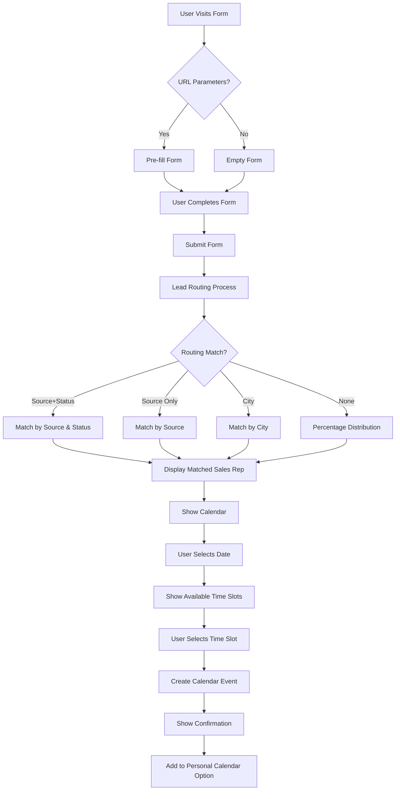
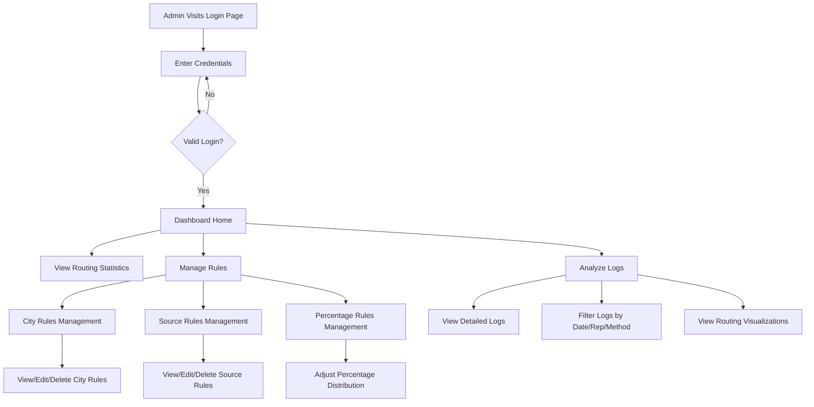
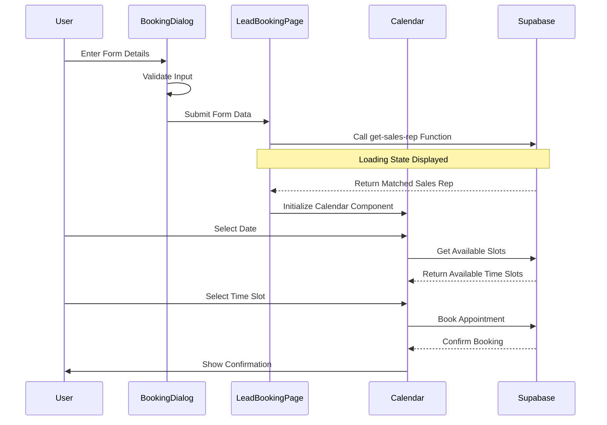
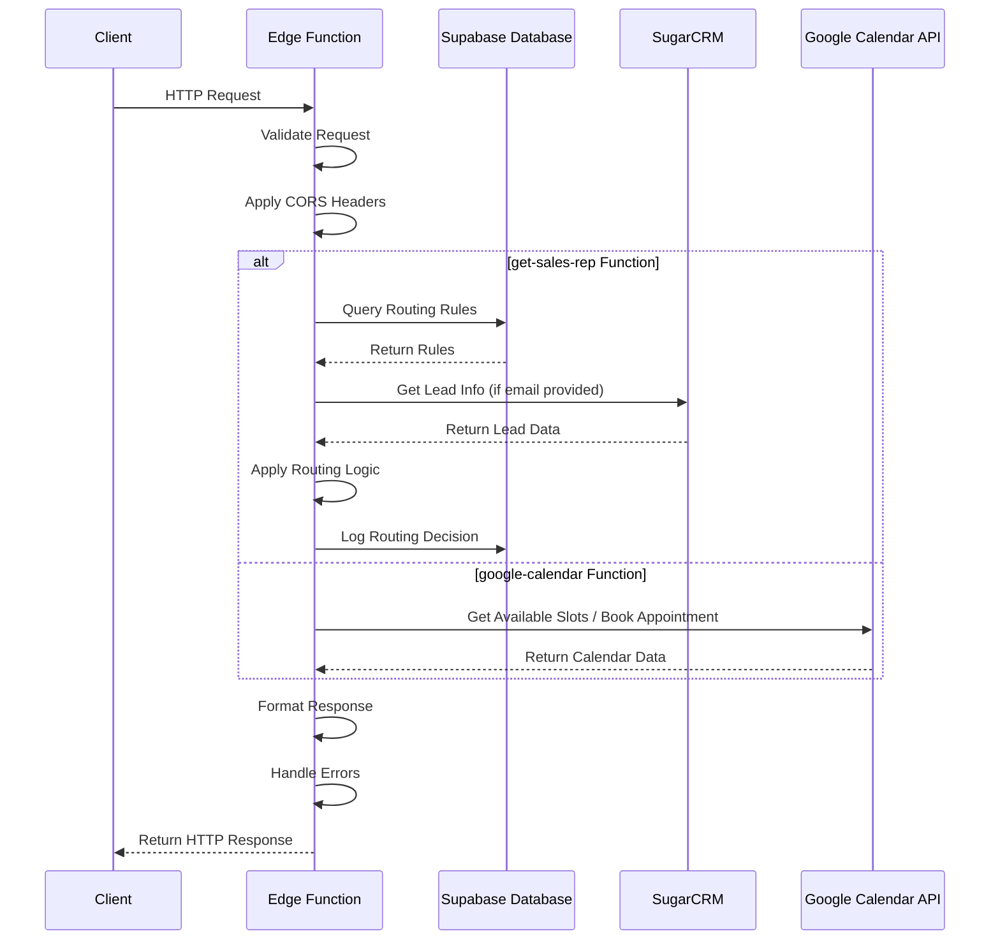

# Lead Routing System - Setup Guide

## Overview

The Lead Routing System is an intelligent lead assignment platform that automatically routes incoming leads to the most appropriate sales representatives based on predefined rules. The system supports multiple routing methods:

- **Source-based routing**: Directs leads from specific sources (e.g., Commercial, Residential) to specialized sales reps
- **City-based routing**: Assigns leads from particular cities to designated sales reps
- **Percentage-based routing**: Distributes remaining leads according to predetermined percentages

The platform features a user-friendly admin interface for managing routing rules, a booking form for lead capture, and comprehensive analytics for tracking routing performance. Built with React on the frontend and Supabase Edge Functions on the backend, it integrates with Google Calendar for appointment scheduling and SugarCRM for lead data enrichment.

## Quick Start

### Setup Requirements

1. Node.js 16+ and npm/yarn
2. Supabase CLI (for edge function development)
3. GitHub account with access to the repository
4. Access to the Supabase project (ask admin for permissions)

### Installation Steps

1. Clone the repository:
   ```bash
   git clone [repository-url]
   cd slot-sync-showcase-75
   ```

2. Install dependencies:
   ```bash
   npm install
   # or
   yarn install
   ```

3. Set up environment variables:
   - Create a `.env` file in the root directory
   - Copy the contents from `.env.example`
   - Ask your team lead for the actual values

4. Start the development server:
   ```bash
   npm run dev
   # or
   yarn dev
   ```

5. Access the application:
   - Frontend: cobaltpower.chau.link
   - Admin interface: cobaltpower.chau.link/admin

## Project Structure

### Key Directories and Files

- `/src` - Frontend React code
  - `/components` - Reusable UI components
  - `/pages` - Page components
  - `/utils` - Utility functions and helpers
  - `/hooks` - Custom React hooks
  - `/integrations` - External service integrations
  - `/types` - TypeScript type definitions

- `/supabase` - Backend Supabase functions
  - `/functions` - Edge Functions
    - `/get-sales-rep` - Lead routing logic
    - `/sugar-crm` - CRM integration
    - `/google-calendar` - Calendar API integration

- `/public` - Static assets
- `/dist` - Build output (do not edit)

### Key Components

- **BookingDialog.tsx** - Main lead entry form with URL parameter handling
- **AdminRouting.tsx** - Admin interface for managing routing rules
- **LeadBookingPage.tsx** - Page that processes form submissions and routes leads

## File Tree Diagram

```
slot-sync-showcase-75/
├── src/
│   ├── components/
│   │   ├── AdminRouting.tsx       # Admin interface for managing routing rules
│   │   ├── BookingDialog.tsx      # Main lead entry form with URL parameters
│   │   ├── RoutingStatsGraph.tsx  # Visualization of routing statistics
│   │   ├── SchedulingCalendar.tsx # Calendar component for booking appointments
│   │   └── ui/                    # Reusable UI components (buttons, forms, etc.)
│   ├── pages/
│   │   ├── AdminDashboardPage.tsx # Admin dashboard with routing management
│   │   ├── BookingConfirmation.tsx# Confirmation page after booking
│   │   ├── LeadBookingPage.tsx    # Main booking page with routing logic
│   │   └── LoginPage.tsx          # Admin login page
│   ├── hooks/
│   │   ├── useAuth.ts             # Authentication hook for admin access
│   │   └── useCalendar.ts         # Calendar API integration hook
│   ├── integrations/
│   │   └── supabase/
│   │       ├── client.ts          # Supabase client setup
│   │       └── types.ts           # TypeScript types for database schema
│   ├── utils/
│   │   ├── dateUtils.ts           # Date handling utilities
│   │   └── routingLogic.ts        # Client-side routing logic implementation
│   └── types/
│       ├── calendar.ts            # Types for calendar functionality
│       └── routing.ts             # Types for routing system
├── supabase/
│   └── functions/
│       ├── _shared/               # Shared code between functions
│       │   └── cors.ts            # CORS headers implementation
│       ├── get-sales-rep/         # Lead routing function
│       │   └── index.ts           # Main routing logic implementation
│       ├── google-calendar/       # Calendar integration function
│       │   └── index.ts           # Calendar API integration
│       └── sugar-crm/             # CRM integration function
│           └── index.ts           # CRM API integration
├── public/                        # Static assets and files
├── documentation/                 # Project documentation
├── lesson_learn.md                # Documented lessons and solutions
├── Lead_Routing_SOP.md            # Standard operating procedures
├── progress.md                    # Project progress tracking
└── Setup_Guide.md                 # This setup guide
```

## Database Tables

### Required Database Tables

1. **`sales_reps`** - Stores information about sales representatives
   - Fields: `id`, `name`, `email`, `phone`, `is_active`, `created_at`
   - Purpose: Contains all sales rep information for routing and display
   - Used by: Routing system, admin interface, booking confirmation

2. **`city_routing_rules`** - Defines both city-based and source-based routing rules
   - Fields: `id`, `city`, `lead_source`, `lead_status`, `status`, `sales_rep_id`, `is_active`, `created_at`
   - Purpose: Determines which sales rep receives leads from specific cities or sources
   - Used by: get-sales-rep function, admin interface

3. **`routing_rules`** - Defines percentage-based routing rules
   - Fields: `id`, `sales_rep_id`, `percentage`, `is_active`, `created_at`
   - Purpose: Controls how unmatched leads are distributed by percentage
   - Used by: get-sales-rep function, admin interface

4. **`routing_logs`** - Records all routing decisions for analytics
   - Fields: `id`, `lead_email`, `lead_city`, `lead_source`, `lead_status`, `assigned_sales_rep_id`, `routing_method`, `routing_criteria`, `random_value`, `created_at`
   - Purpose: Tracks routing decisions for analysis and debugging
   - Used by: Admin dashboard, routing statistics graphs

5. **`sugar_crm_tokens`** - Stores authentication tokens for SugarCRM integration
   - Fields: `id`, `access_token`, `refresh_token`, `expires_at`, `created_at`
   - Purpose: Manages API authentication for CRM integration
   - Used by: sugar-crm function

6. **`members`** - Stores admin user credentials for dashboard access
   - Fields: `id`, `email`, `password`, `role`, `created_at`
   - Purpose: Controls access to admin functionality
   - Used by: Login page, authentication system

## User Flow

### Lead Booking Flow

1. **Lead Entry**
   - User visits booking form (directly or via URL with parameters)
   - Form is pre-filled if URL parameters are provided
   - User completes required information

2. **Routing Process**
   - System sends lead data to get-sales-rep function
   - Function applies routing rules in priority order:
     1. Source + Status based rules
     2. Source-only based rules
     3. City-based rules
     4. Percentage-based rules (fallback)
   - Matching sales rep is returned

3. **Calendar Booking**
   - System displays matched sales rep details
   - User selects date from calendar
   - Available time slots are shown
   - User selects preferred time slot

4. **Confirmation**
   - Appointment is created in sales rep's calendar
   - Confirmation page displays booking details
   - User can add event to their personal calendar

### User Flow Mermaid Diagram



### Admin Flow

1. **Authentication**
   - Admin navigates to admin login page
   - Admin enters credentials
   - System validates login information

2. **Dashboard Access**
   - Admin views routing statistics
   - Admin can filter data by date range

3. **Rule Management**
   - Admin can view/edit/delete city rules
   - Admin can view/edit/delete source rules
   - Admin can adjust percentage distributions

4. **Log Analysis**
   - Admin can view detailed routing logs
   - Logs show which rules were applied for each lead
   - Visualization shows routing method distribution

### Admin Flow Mermaid Diagram



## Frontend and Backend Flow

### Frontend Flow

1. **Component Initialization**
   - React components mount and initialize state
   - URL parameters are parsed in BookingDialog component
   - Form data is initialized with default or URL-provided values

2. **User Input Handling**
   - Form captures user input with controlled components
   - Validation occurs on input and form submission
   - Data is prepared for submission to backend

3. **API Interaction**
   - Frontend calls Supabase Edge Functions via fetch or Supabase client
   - Loading states are displayed during API calls
   - Response data is processed and displayed to user

4. **State Management**
   - Form data is managed with React state
   - Complex state uses React Context where appropriate
   - Session storage preserves data between page navigation

### Frontend Flow Mermaid Diagram



### Frontend Flow ASCII Diagram

```
┌─────────────────┐     ┌──────────────────┐     ┌───────────────────┐
│                 │     │                  │     │                   │
│  BookingDialog  │────►│  LeadBookingPage │────►│  SchedulingCalendar│
│                 │     │                  │     │                   │
└────────┬────────┘     └────────┬─────────┘     └─────────┬─────────┘
         │                       │                         │
         │                       │                         │
         ▼                       ▼                         ▼
┌─────────────────┐     ┌──────────────────┐     ┌───────────────────┐
│   URL Params    │     │   Sales Rep      │     │   Calendar API    │
│   Processing    │     │   Matching       │     │   Integration     │
└─────────────────┘     └──────────────────┘     └───────────────────┘
```

### Backend Flow

1. **Edge Function Invocation**
   - Supabase Edge Function receives request
   - Request is validated and parsed
   - CORS headers are applied for cross-origin requests

2. **Database Interaction**
   - Edge Function queries Supabase database
   - Relevant data is retrieved (rules, sales reps, etc.)
   - Data is processed according to business logic

3. **External API Calls**
   - Edge Function may call SugarCRM API for lead data
   - Google Calendar API for appointment scheduling
   - Results are processed and transformed

4. **Response Generation**
   - Processed data is structured for response
   - Error handling is applied where necessary
   - Response is returned to frontend with appropriate status code

### Backend Flow Mermaid Diagram



### Backend Flow ASCII Diagram

```
  Client Request
       │
       ▼
┌─────────────────┐
│ Edge Function   │
│                 │
│  ┌───────────┐  │
│  │  Validate │  │
│  │  Request  │  │
│  └───────────┘  │
│                 │
│  ┌───────────┐  │      ┌───────────────┐
│  │  Database │◄─┼─────►│  Supabase DB  │
│  │  Queries  │  │      └───────────────┘
│  └───────────┘  │
│                 │
│  ┌───────────┐  │      ┌───────────────┐
│  │ External  │◄─┼─────►│   SugarCRM    │
│  │ API Calls │  │      └───────────────┘
│  └───────────┘  │
│                 │      ┌───────────────┐
│  ┌───────────┐  │      │    Google     │
│  │ Response  │◄─┼─────►│  Calendar API │
│  │ Generation│  │      └───────────────┘
│  └───────────┘  │
└────────┬────────┘
         │
         ▼
    Client Response
```

## User Stories

1. **As a lead**, I want to book an appointment with a sales representative who specializes in my area, so that I receive the most relevant expertise for my needs.

2. **As a lead from a commercial source**, I want to be automatically routed to a commercial specialist when I fill out the booking form, so that I don't waste time with residential-focused sales reps.

3. **As an admin**, I want to create routing rules based on lead source and status, so that leads are matched with appropriate sales representatives.

4. **As an admin**, I want to create city-based routing rules, so that leads from specific geographic areas are handled by sales reps familiar with those regions.

5. **As an admin**, I want to set percentage-based distribution for leads that don't match other rules, so that workload is balanced fairly among the team.

6. **As an admin**, I want to view routing statistics and visualizations, so that I can understand how leads are being distributed and optimize the routing rules.

7. **As a sales rep**, I want leads to be automatically added to my Google Calendar, so that I don't have to manually track appointments.

8. **As a project manager**, I want to ensure that commercial leads with "New" status are always routed to the commercial specialist, so that we provide appropriate expertise for high-value leads.

9. **As a lead with specific requirements**, I want the booking form to accept URL parameters, so that my information can be pre-filled and I'm matched with the right sales rep automatically.

10. **As a new developer**, I want comprehensive documentation and setup instructions, so that I can quickly understand the system and contribute effectively.

## Implementation Stages

### Stage 1: Core Infrastructure (Completed)
- Set up Supabase project and database tables
- Create basic edge functions for routing
- Implement frontend form components
- Establish database schema for routing rules

### Stage 2: Basic Routing Logic (Completed)
- Implement percentage-based routing
- Add city-based routing rules
- Create admin interface for rule management
- Implement logging for routing decisions

### Stage 3: Advanced Routing Features (Completed)
- Add source-based routing logic
- Implement combined source+status routing
- Add URL parameter handling
- Create routing statistics visualizations

### Stage 4: Calendar Integration (Completed)
- Set up Google Calendar API integration
- Create booking and availability checking
- Implement appointment creation
- Add calendar UI components

### Stage 5: CRM Integration (Completed)
- Integrate SugarCRM for lead data
- Add lead status handling
- Implement lead source tracking
- Connect CRM data to routing decisions

### Stage 6: Testing and Optimization (Current)
- Comprehensive testing of all routing scenarios
- Performance optimization
- Bug fixing and edge case handling
- Documentation and SOP creation

### Stage 7: Future Enhancements (Planned)
- Email notifications
- SMS reminders
- Analytics dashboard improvements
- Integration with additional CRM systems

## Roadmap

### Q2 2024 (Completed)
- Basic routing system implementation
- Admin interface development
- Google Calendar integration
- SugarCRM integration
- URL parameter handling

### Q3 2024 (Current)
- Documentation and SOP completion
- Comprehensive testing and bug fixing
- Performance optimization
- User experience improvements
- Training materials development

### Q4 2024 (Planned)
- Email notification system
- SMS reminders for appointments
- Enhanced analytics dashboard
- Mobile optimization improvements
- Additional CRM integrations

### Q1 2025 (Planned)
- AI-based routing suggestions
- Automated testing infrastructure
- Performance monitoring system
- Multi-language support
- White-label customization options

## Development Workflow

### Making Changes

1. Create a new branch for your feature/fix:
   ```bash
   git checkout -b feature/your-feature-name
   ```

2. Make your changes
3. Test thoroughly (see below)
4. Commit and push your changes:
   ```bash
   git add .
   git commit -m "Descriptive commit message"
   git push origin feature/your-feature-name
   ```

5. Create a Pull Request on GitHub for review

### Testing

1. **URL Parameter Testing**
   - Test the booking form with URL parameters:
   ```
   cobaltpower.chau.link/book?first_name=Test&last_name=User&email_address=test@example.com&phone=+1234567890&city=TestCity&lead_status=New&lead_source=Commercial
   ```

2. **Routing Rule Testing**
   - Add test rules in the admin interface
   - Test with different lead source, status, and city combinations
   - Check the routing logs in the admin dashboard

3. **Edge Function Testing**
   - Use the Supabase CLI for local development:
   ```bash
   supabase start
   supabase functions serve
   ```

### Deploying Edge Functions

1. Log in to Supabase:
   ```bash
   supabase login
   ```

2. Deploy a specific function:
   ```bash
   supabase functions deploy get-sales-rep --project-ref xpwdtjmtaqzrjyeazszz
   ```

## Troubleshooting

### Common Issues

1. **Edge Function Not Responding**
   - Check Supabase logs in the dashboard
   - Verify function deployment was successful
   - Test function directly with curl or Postman
   - Check CORS headers if calling from browser

2. **Routing Not Working**
   - Check browser console for errors
   - Verify the routing rule exists in the database
   - Check URL parameters are formatted correctly
   - Look at routing logs in the database

3. **Database Access Issues**
   - Check Supabase permissions and RLS policies
   - Verify your API keys are correct
   - Test queries directly in the Supabase dashboard

## Resources

- **Documentation**
  - Lead_Routing_SOP.md - Standard operating procedures
  - lesson_learn.md - Lessons learned from past issues
  - progress.md - Historical record of system development and improvements

- **External Documentation**
  - [Supabase Documentation](https://supabase.com/docs)
  - [React Documentation](https://reactjs.org/docs/getting-started.html)
  - [Google Calendar API](https://developers.google.com/calendar)

- **Support**
  - Contact your team lead for project-specific questions
  - Use the #tech-support Slack channel for technical issues 